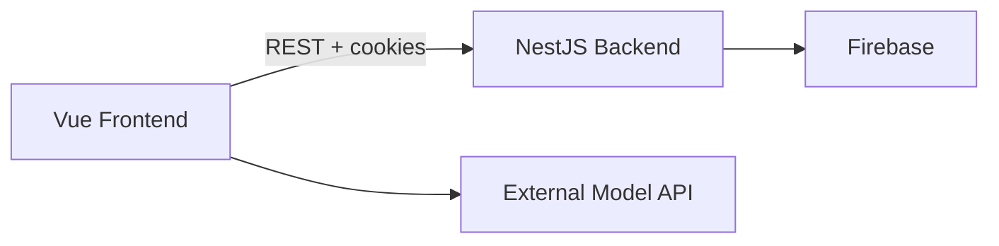

# ChatGPT Clone Monorepo

> [!WARNING]
> This monorepo combines the original split repositories:
> [chat-gpt-clone-backend](https://github.com/deniSSTK/chat-gpt-clone-backend),
> [chat-gpt-clone-frontend](https://github.com/deniSSTK/chat-gpt-clone-frontend),
> and
> [model-fast-api](https://github.com/deniSSTK/model-fast-api).

> [!IMPORTANT]
> The live demo is currently unavailable because the backend is not deployed at the moment.

<p align="center">
  Full-stack ChatGPT-style application with authentication, persistent chat history, shareable conversations, profile pages, image gallery support, and Docker-based local deployment.
</p>

<p align="center">
  <a href="https://vuejs.org/">
    
  </a>
  <a href="https://vite.dev/">
    
  </a>
  <a href="https://www.typescriptlang.org/">
    
  </a>
</p>

<p align="center">
  <a href="https://nestjs.com/">
    
  </a>
  <a href="https://firebase.google.com/">
    
  </a>
  <a href="https://www.docker.com/">
    
  </a>
  <a href="https://nginx.org/">
    
  </a>
</p>

## Overview

This repository contains the full project in one place:

- `frontend` - a Vue 3 + Vite single-page application
- `backend` - a NestJS API for authentication, chats, personalization, profiles, and Firebase integration
- `backend-image` - a FastAPI service for image generation and chat completions using G4F

Main features:

- user sign up and log in
- persistent chat history
- shareable chat routes
- image gallery support
- public and private profile pages
- assistant personality styles
- chat export to PDF

## Architecture



### Current flow

- the frontend talks to the backend through `VITE_NEST_API_URL`
- the backend handles auth, cookies, chat persistence, personalization, profiles, and Firebase access
- text and image generation are currently called directly from the frontend through an external `model-fast-api` service
- `docker-compose.yml` runs the frontend and backend together from this monorepo
- inside Docker, Nginx proxies `/api` to the backend service

## Project structure

```text
.
├── backend/              # NestJS API
│   ├── src/
│   │   ├── authentication/
│   │   ├── chats/
│   │   ├── firebase/
│   │   └── personalization/
│   ├── Dockerfile
│   └── .env.example
├── backend-image/        # FastAPI service
│   ├── main.py
│   ├── requirements.txt
│   └── Dockerfile
├── frontend/             # Vue 3 client
│   ├── src/
│   │   ├── components/
│   │   ├── services/
│   │   ├── views/
│   │   └── router/
│   ├── nginx/
│   ├── Dockerfile
│   └── .env.example
├── docker-compose.yml
└── README.md
```

## Quick start with Docker

### 1. Add the Firebase service account key

Place your Firebase service account JSON here:

```bash
backend/secrets/firebaseServiceAccountKey.json
```

The folder already exists in the repository. The JSON key should not be committed to git.

### 2. Start the project

```bash
docker compose up --build
```

After startup:

- frontend: `http://localhost:8080`
- backend: `http://localhost:3000`
- backend-image: `http://localhost:8000`

## Local development without Docker

### Backend

```bash
cd backend
npm install
```

Create `backend/.env`:

```env
NODE_ENV=development
PORT=3000
CLIENT_URL=http://localhost:5173
FIREBASE_SERVICE_ACCOUNT_PATH=./secrets/firebaseServiceAccountKey.json
```

Run:

```bash
npm run start:dev
```

### Frontend

```bash
cd frontend
npm install
```

Create `frontend/.env`:

```env
VITE_NEST_API_URL=http://localhost:3000
```

Run:

```bash
npm run dev
```

Vite starts on `http://localhost:5173` by default.

## Available routes

- `/log-in` - login page
- `/sign-up` - registration page
- `/c/:id` - chat page
- `/share/:id` - shared chat page
- `/gallery` - public image gallery
- `/p/:id` - user profile page

## Tech stack

<p>
  
  
  
  
  
  
  
</p>

## Notes

- all three services (frontend, backend, and backend-image) are now containerized
- the backend-image service provides image generation and chat completions using G4F
- the setup is now fully self-hosted within this repository

## Possible next improvements

- add healthchecks and a better startup strategy in compose
- centralize environment setup at the root level
- add root scripts so the whole project can be started without manually changing directories
